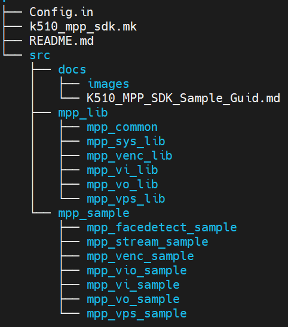
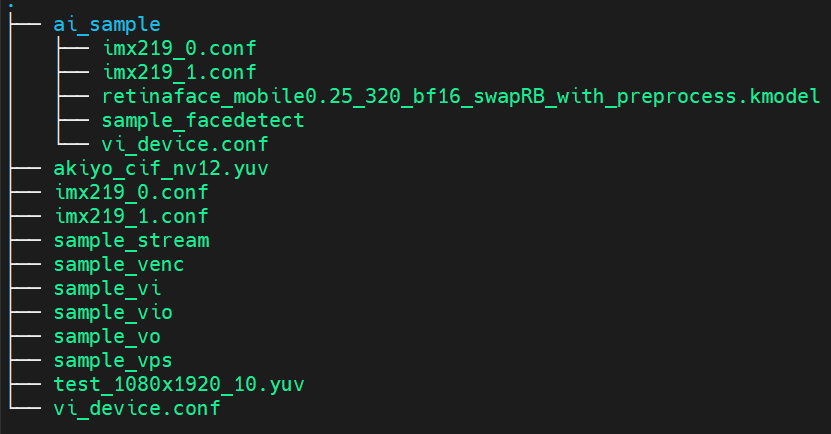
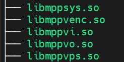
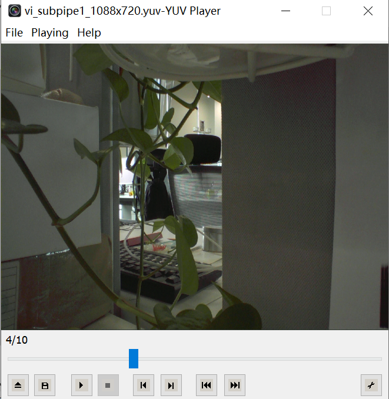
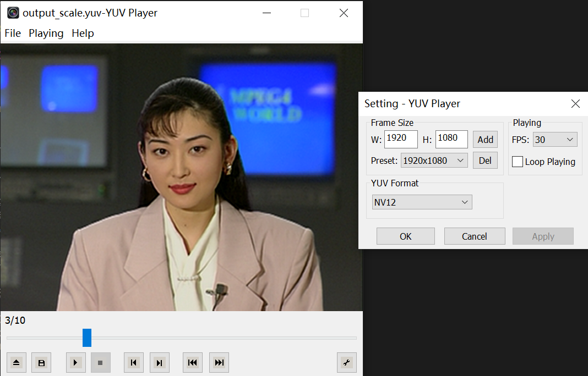
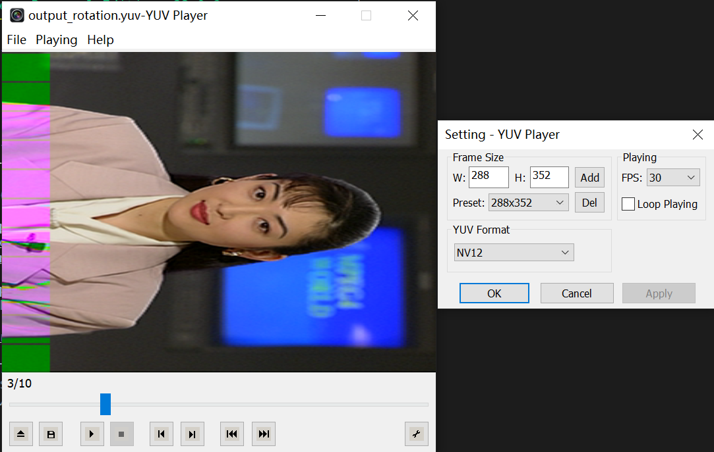
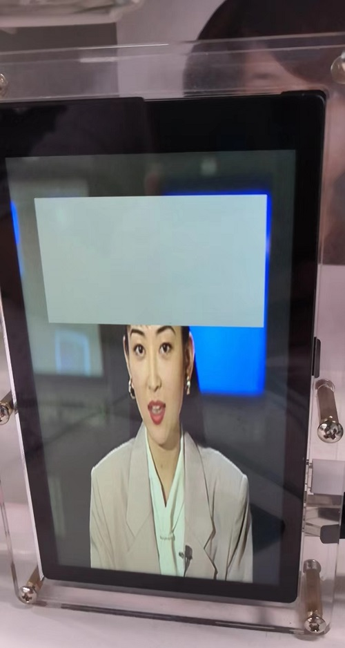
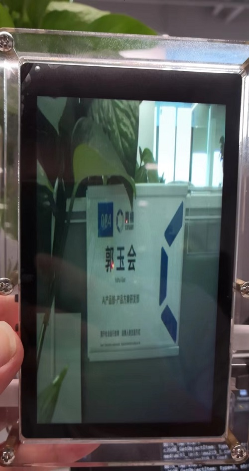
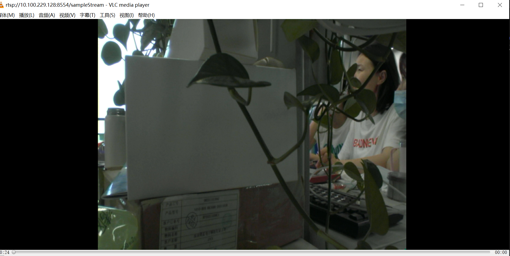
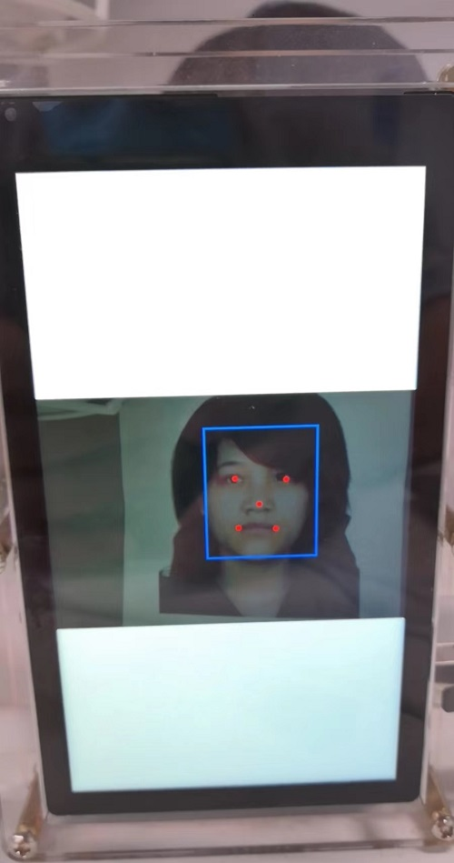

<font face="黑体" size=6>**K510 SDK Mpp SDK Sample Guide**</font>

<font face="黑体"  size=3>文档版本：V0.0.2</font>

<font face="黑体"  size=3>发布日期：2022-06-29</font>

<font face="黑体" size=3>**免责声明**</font>
您购买的产品、服务或特性等应受北京嘉楠捷思信息技术有限公司（“本公司”，下同）商业合同和条款的约束，本文档中描述的全部或部分产品、服务或特性可能不在您的购买或使用范围之内。除非合同另有约定，本公司不对本文档的任何陈述、信息、内容的准确性、可靠性、完整性、营销型、特定目的性和非侵略性提供任何明示或默示的声明或保证。除非另有约定，本文档仅作为使用指导的参考。由于产品版本升级或其他原因，本文档内容将可能在未经任何通知的情况下，不定期进行更新或修改。

<font face="黑体"  size=3>**商标声明**</font>

""、“Canaan”图标、嘉楠和嘉楠其他商标均为北京嘉楠捷思信息技术有限公司的商标。本文档可能提及的其他所有商标或注册商标，由各自的所有人拥有。

<font face="黑体"  size=3>**版权所有©2022北京嘉楠捷思信息技术有限公司**</font>
本文档仅适用K510平台开发设计，非经本公司书面许可，任何单位和个人不得以任何形式对本文档的部分或全部内容传播。

<font face="黑体"  size=3>**北京嘉楠捷思信息技术有限公司**</font>
网址：canaan-creative.com
商务垂询：salesAI@canaan-creative.com

<font face="黑体"  size=3>**文档目的**</font>
本文档为K510 MPP SDK Demo的说明文档。

<font face="黑体"  size=3>**读者对象**</font>
本文档（本指南）主要适用的人员：

- 软件开发人员
- 测试开发人员
- 技术支持人员

<front face="黑体" size=3>**修订记录**</front>
<font face="宋体"  size=2>修订记录累积了每次文档更新的说明。最新版本的文档包含以前所有版本的更新内容。</font>

| 版本号 | 修改者 | 修订日期   | 修订说明                                                                                                                        |
| ------ | ------ | ---------- | ------------------------------------------------------------------------------------------------------------------------------- |
| V0.0.1 | 产品方案研发部 | 2022-06-24 | 1. K510 MPP SDK Demo Guid文档创建<br />2. K510 MPP SDK 各demo基本信息描述                                                       |
| V0.1 | 产品方案研发部 | 2022-06-29 | 1. K510 MPP SDK 各demo功能介绍<br />2. K510 MPP SDK 各demo参数介绍<br />3. K510 MPP SDK 各demo自测结果细化<br />4. 文档格式整理 |
|        |        |            |                                                                                                                                 |
|        |        |            |                                                                                                                                 |
|        |        |            |                                                                                                                                 |
|        |        |            |                                                                                                                                 |
|        |        |            |                                                                                                                                 |
|        |        |            |                                                                                                                                 |
|        |        |            |                                                                                                                                 |

<div style="page-break-after:always"></div>
<font face="黑体"  size=6>目 录</font>

[toc]


# 1 简介

K510 MPP SDK，作为K510平台上媒体处理SDK，设计目的在于帮助应用软件快速开发；对于应用软件来说不需要关注芯片各个模块的底层实现，只需要正确使用MPP各模块的接口来完成相应的功能即可。K510 MPP SDK提供以下四个模块：视频输入模块VI、视频处理模块VPS、视频编码模块VENC、视频输出模块VO。对于各模块接口后续会提供《K510 MPP SDK开发者手册》，本文档只对现有sample做出说明。

## 1.1 K510 MPP SDK代码结构介绍

K510 MPP SDK代码结构如下图：

其中，mpp_lib目录下是各个模块的sdk，mpp_sample目录下是目前有的7个sample。docs目录下是该sdk的相关文档描述。

## 1.3 K510 MPP SDK代码编译

获取k510_buildroot后，直接编译便可生成k510_mpp_sdk的可执行文件以及各个模块的动态库。

- 编译成功后，在k510_buildroot/k510_crb_lp3_v1_2_defconfig/target/app/mpp_sample下会生成各个sample的可执行文件、自测使用的yuv源以及conf配置文件，如下图：

  
  其中ai_sample目录下为ai sample可执行文件以及相关conf配置文件。
- 同时在k510_buildroot/k510_crb_lp3_v1_2_defconfig/target/lib64/lp64d下会生成各个模块的动态库，如下图：

  

  至此编译完成。

<div style="page-break-after:always"></div>

# 2 K510 MPP SDK Sample说明

## 2.1 Sample介绍

目前已有7个sample，包括4个模块使用sample和3个多模块串联pipeline sample。各个sample需要拷贝到K510开发板上运行。

- 与k510_buildroot/target/app/mpp_sample目录结构相对应，在开发板上创建/app/mpp_sample和/app/mpp_sample/ai_sample目录：(也可以不创建，为了结构清晰建议创建)
  ```shell
  mkdir -p /app/mpp_sample/ai_sample
  ```
- 将编译生成的各sample可执行文件、测试用输入源以及conf配置文件对应的拷贝到开发板/app/mpp_sample和/app/mpp_sample/ai_sample下，需要说明的是conf配置文件目前固定名称为vi_device.conf，不能更改名称，后续会支持名称可配。
- 将编译生成的各mpp动态库拷贝到开发板/lib64/lp64d/下。

## 2.2 sample详细说明

### 2.2.1 mpp_vi_sample

该sample旨在说明VI模块接口的简单使用，通过配合conf配置文件，将摄像头采集的图片保存为文件，该sample编译生成sample_vi可执行文件。

执行sample_vi：

```shell
./sample_vi
```

执行结束生成vi_subpipe1_1088x720.yuv文件，考虑到yuv文件较大，所以只生成10帧数据，可通过yuv播放工具打开，如下图



### 2.2.2 mpp_vps_sample

该sample旨在说明VPS模块接口的简单使用，通过参数配置支持缩放scaler和旋转rotation，并将结果保存为文件，该sample编译生成sample_vps可执行文件。

- 参数说明

  | 参数     |                                 说明                                 |
  | :------- | :------------------------------------------------------------------: |
  | -i       |                            输入源yuv文件                            |
  | -type    | 启用vps何种功能，scale表示缩放，rotation表示旋转。目前只支持旋转90度 |
  | -inFmt   |                    输入源像素格式，目前只支持nv12                    |
  | -inputW  |                               输入源宽                               |
  | -inputH  |                               输入源高                               |
  | -o       |                              输出文件名                              |
  | -outFmt  |                     输出文件格式，目前只支持nv12                     |
  | -outputW |                              输出文件宽                              |
  | -outputH |                              输出文件高                              |
- sample_vps缩放测试

  ```shell
  ./sample_vps -i ./akiyo_cif_nv12.yuv -type scale -inFmt nv12 -inputW 352 -inputH 288 -o output_scale.yuv -outFmt nv12 -outputW 1920 -outputH 1080
  ```

  其中输入源akiyo_cif_nv12.yuv分辨率为352x288，执行结束生成output_scale.yuv文件，分辨率为1920x1080，格式为NV12，同样考虑到yuv文件较大，所以只生成了10帧数据，可通过yuv播放工具打开，如下图：

  
- sample_vps旋转测试(需要说明的是旋转之后左边界出现花屏是已知问题，待底层修复)

  ```shell
  ./sample_vps -i ./akiyo_cif_nv12.yuv -type rotation -inFmt nv12 -inputW 352 -inputH 288 -o output_rotation.yuv -outFmt nv12 -outputW 288 -outputH 352
  ```

  其中输入源akiyo_cif_nv12.yuv分辨率为352x288，执行结束生成output_rotation.yuv文件，分辨率为288x352，格式为NV12，同样只生成了10帧数据，可通过yuv播放工具打开，如下图：

  

### 2.2.3 mpp_venc_sample

该sample旨在说明VENC模块接口的简单使用，通过参数配置实现编码功能，并将编码结果保存在264码流文件，该sample编译生成sample_venc可执行文件。

- 参数说明

  |   参数   |             说明             |
  | :------: | :---------------------------: |
  |    -i    |         输入源yuv文件         |
  |   -fmt   | 输入源yuv文件格式，只支持nv12 |
  |    -t    | 编码类型，目前支持264格式编码 |
  |    -w    |         输入源文件宽         |
  |    -h    |         输入源文件高         |
  |    -p    |     h264编码采用的profile     |
  |    -l    |      h264编码采用的level      |
  |   -rc   |    h264编码采用的码控模式    |
  |   -fps   |       h264编码设置帧率       |
  |   -qp   |    h264编码采用的初始qp值    |
  | -goplen |        h264编码GOP长度        |
  | -bitrate |       h264编码码流设置       |
  |    -o    |      h264编码码流文件名      |
- h264编码测试

  ```shell
  ./sample_venc -i ./akiyo_cif_nv12.yuv -fmt nv12 -w 352 -h 288 -t h264 -p high -l 42 -rc cbr -fps 30 -qp 25 -goplen 30 -bitrate 3000000 -o output.264
  ```

  该sample执行完后生成output.264文件，通过h264解码工具或者播放器可查看码流是否正常，如下图：

  

### 2.2.4 mpp_vo_sample

该sample旨在说明VO模块的简单使用，通过参数配置可实现将输入源通过VO模块作为基本层在显示屏上显示,同时在基本层之上会显示一个880x500的灰色图层，以此说明VO模块支持多图层显示，需要说明的是当前sample不支持图层位置可配，该sample编译生成sample_vo可执行文件。

- 参数说明

  |  参数  |           说明           |
  | :-----: | :-----------------------: |
  |   -i   | 输入源yuv，目前只支持NV12 |
  | -inFmt |       输入源yuv格式       |
  | -inputW |         输入源宽         |
  | -inputH |         输入源高         |
- vo功能测试

  ```shell
  ./sample_vo -i ./test_1080x1920_10.yuv -inFmt nv12 -inputW 1080 -inputH 1920
  ```

执行上述命令在K510开发板上显示屏会播放输入的源文件内容，同时内容之上会出现灰色图层，如下图：



### 2.2.5 mpp_vio_sample

该sample旨在对VI、VPS和VO三个模块串联pipeline的简单说明，通过参数配置并配合conf配置文件实现从VI采集640x480视频源，经过VPS缩放后通过VO模块显示，该sample编译生成sample_vio可执行文件。

- 参数说明

  |    参数    |                说明                |
  | :---------: | :--------------------------------: |
  |   -inFmt   | VI采集视频源的格式，目前只支持NV12 |
  |  -vpsType  | VPS功能类型，该sample采用scale功能 |
  | -vpsOutputW |       VPS模块scale缩放后的宽       |
  | -vpsOutputH |       VPS模块scale缩放后的高       |
- VI--->VPS--->VO pipeline sample测试

  ```shell
  ./sample_vio -inFmt nv12 -vpsType scale -vpsOutputW 1088 -vpsOutputH 1920
  ```

执行上述命令后在K510开发板上显示屏会播放摄像头采集的图像内容，如下图：



### 2.2.6 mpp_stream_sample

该sample旨在对VI、VPS和VENC三个模块串联，并将编码码流通过推流方式推流出去的整个pipeline的简单说明，通过参数配置并配合conf配置文件实现VI采集640x480图片，通过VPS缩放到1088x1920，然后通过VENC进行编码，并将编码码流推流出去，可通过VLC进行拉流查看推流情况，该sample编译生成sample_stream可执行文件。

- 参数说明

  |    参数    |                  说明                  |
  | :---------: | :------------------------------------: |
  |  -vpsType  | VPS模块功能类型，该sample采用scale功能 |
  | -vpsOutputW |         VPS模块scale缩放后的宽         |
  | -vpsOutputH |         VPS模块scale缩放后的高         |
- VI--->VPS--->VENC--->推流 pipeline sample测试

  ```shell
  ./sample_stream -vpsType scale -vpsOutputW 1088 -vpsOutputH 1920
  ```

  执行上述命令后，可通过VLC进行拉流查看推流情况，拉流地址为：rtsp://10.100.229.128:8554/sampleStream，注意该IP为笔者IP，测试请更新为自己的IP地址，通过VLC拉流查看如下图：

  

### 2.2.7 mpp_facedetect_sample

该sample旨在说明VI、AI以及VO串联pipeline的简单使用，通过参数配置以及VI模块配合conf以及检测模型，对采集的图像进行人脸检测，检测之后的结果通过VO模块显示，该sample编译生成sample_facedetec可执行文件。

- 参数说明

  |   参数   |                     说明                     |
  | :------: | :-------------------------------------------: |
  | -kmodel |         人脸检测使用的kmodel文件路径         |
  | -netLen | 人脸检测使用的模型的输入分辨率，netLen*netLen |
  | -detectW |        VI模块送给AI计算的图像输入宽度        |
  | -detectH |        VI模块送给AI计算的图像输入高度        |
  | -objThr |                人脸检测的阈值                |
  | -nmsThr |         人脸检测的非极大值抑制的阈值         |
- VI--->AI(face detect)--->VO pipeline sample测试

  ```shell
  ./sample_facedetect -kmodel ./retinaface_mobile0.25_320_bf16_swapRB_with_preprocess.kmodel -netLen 320 -detectW 320 -detectH 240 -objThr 0.5 -nmsThr 0.2
  ```

执行上述命令后，可通过K510开发板显示屏查看人脸检测结果，如下图：



### 备注

鉴于开发人力和开发时间有限，k510_mpp_sdk自测并不充分，烦请测试人员对于任何问题请及时通知开发人员进行处理。
